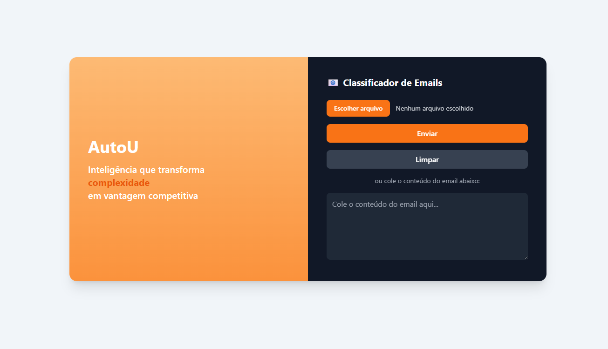

# AutoU - Classificador Inteligente de Emails 📧


AutoU é uma aplicação web desenvolvida em Flask que utiliza a API do Google Generative AI para classificar e-mails, ajudando a priorizar mensagens que exigem ação e sugerindo respostas adequadas.

### ✨ [Acesse a demonstração ao vivo aqui!](https://case-pratico-auto-u-alpha.vercel.app/process)

_(Lembre-se de substituir pelo link do seu projeto na Vercel)_

---

### 📸 Demonstração



## 🎯 Sobre o Projeto

O objetivo é otimizar o gerenciamento de e-mails através da automação. A aplicação analisa o conteúdo de um e-mail (seja colado diretamente ou extraído de um arquivo `.txt` ou `.pdf`) e o classifica em duas categorias principais:

- **Produtivo**: E-mails que demandam uma ação, como solicitações, problemas ou dúvidas.
- **Improdutivo**: E-mails que não necessitam de uma ação imediata, como agradecimentos, felicitações ou spams.

Além da classificação, a ferramenta gera uma sugestão de resposta profissional e adequada ao contexto, utilizando o poder da IA generativa.

## 🚀 Funcionalidades

- **Classificação com IA**: Usa o Google Generative AI para uma análise semântica precisa.
- **Geração de Respostas**: Sugere um rascunho de resposta com base na categoria do e-mail.
- **Upload de Arquivos**: Suporta o envio de arquivos `.txt` e `.pdf` para extração de texto.
- **Interface Simples**: Interface limpa e intuitiva construída com Tailwind CSS.
- **Sistema de Fallback**: Caso a API de IA não esteja disponível, um sistema de classificação baseado em regras é utilizado como alternativa.

## 🛠️ Tecnologias Utilizadas

- **Backend**: Python 3, Flask
- **Inteligência Artificial**: Google Generative AI
- **Processamento de Texto**: NLTK, PyPDF2
- **Frontend**: HTML, Tailwind CSS
- **Deployment**: Vercel

## ⚙️ Como Executar Localmente

Siga os passos abaixo para configurar e executar o projeto no seu ambiente local.

### Pré-requisitos

- [Python 3.9+](https://www.python.org/downloads/)
- [Git](https://git-scm.com/)
- Um editor de código (ex: VS Code)

### Passos para Instalação

1.  **Clone o repositório:**

    ```bash
    git clone [https://github.com/seu-usuario/seu-repositorio.git](https://github.com/seu-usuario/seu-repositorio.git)
    cd seu-repositorio
    ```

2.  **Crie e ative um ambiente virtual (recomendado):**

    ```bash
    # Para Linux/macOS
    python3 -m venv venv
    source venv/bin/activate

    # Para Windows
    python -m venv venv
    .\venv\Scripts\activate
    ```

3.  **Instale as dependências:**

    ```bash
    pip install -r requirements.txt
    ```

4.  **Configure as variáveis de ambiente:**

    - Crie um arquivo chamado `.env` na raiz do projeto.
    - Adicione sua chave da API do Google GenAI a ele:
      ```
      GENAI_API_KEY="SUA_CHAVE_DE_API_SECRETA_AQUI"
      ```

5.  **Execute a aplicação:**
    ```bash
    flask run
    ```
    Acesse `http://127.0.0.1:5000` no seu navegador.

---

Feito por [Laura Tigre]
